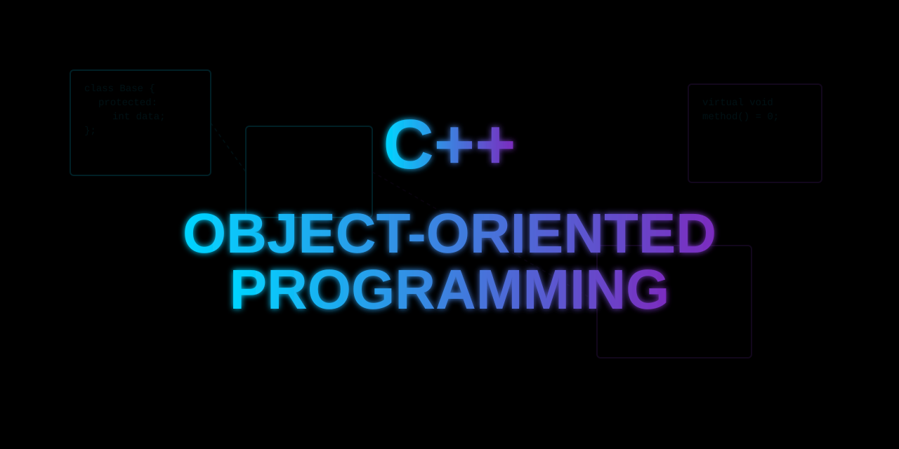

<h1 align="center">
  Common Core 42 - CPP
</h1>

<p align="center">
  
</p>

<p align="center">
    <b><i>This project is part of the fifth milestone of the 42 cursus</i></b>
</p>

<h3 align="center">
    <a href="#-about">About</a>
    <span> · </span>
    <a href="#-usage">Usage</a>
    <span> · </span>
    <a href="#-references">References</a>
</h3>

## 📖 About

The goal of CPP modules is to learning as most as possible about Object-oriented programming, diving deeper into subject such as:

### CPP00:

- **Classes and objects**

- **Namespaces**

- **Stdio streams**

- **Casting**

### CPP01:

- **Memory allocation**

- **Pointers and references**

- **Loop Statements**

### CPP02:

- **Polymorphism**

- **Operator overloading**

- **Orthodox canonical class form**

- **Fixed pointers**

### CPP03

- **Inheritance**

### CPP04:

- **Subtype polymorphism**

- **Abstract classes and interfaces**

### CPP05:
- **Exceptions and error handling**
- **try / throw / catch blocks**
- **Custom exception classes (nested or standalone)**
- **std::exception and inheritance from it**
- **Exception propagation up the call stack**
- **RAII and exception safety**

### CPP06:
- **C++ style casts**
- **static_cast** — compile-time checked conversions between compatible types
- **dynamic_cast** — safe runtime downcasting in polymorphic hierarchies (returns `nullptr` or throws on failure)
- **reinterpret_cast** — low-level bit-pattern reinterpretation between unrelated types
- **const_cast** — adding or removing `const` qualifier
- **Serialization and deserialization of pointers (uintptr_t)**
- **Runtime type identification (RTTI)**

### CPP07:
- **C++ templates**
- **Function templates** — generic functions operating on any type
- **Class templates** — generic classes parameterized by type
- **Template specialization** — providing a specific implementation for a given type
- **Template instantiation** — how the compiler generates concrete code from templates
- **The `typename` keyword**

### CPP08:
- **Templated containers, iterators, and algorithms**
- **STL sequence containers** — `std::vector`, `std::list`, `std::deque`
- **STL associative containers** — `std::map`, `std::set`
- **Iterators** — input, output, forward, bidirectional, random access
- **STL algorithms** — `std::find`, `std::sort`, `std::for_each`, etc.
- **Writing generic functions that work with any STL-compatible container**
- **`std::stack` and `std::span` (custom implementations)**

### CPP09:
- **STL — applied and combined use cases**
- **`std::map`** — key-value storage with ordered traversal (used for Bitcoin exchange rate lookup)
- **`std::stack`** — LIFO structure (used for Reverse Polish Notation calculator)
- **`std::vector` and `std::list`** — compared and combined for sorting algorithms
- **Ford-Johnson algorithm (merge-insertion sort)** — minimizing the number of comparisons to sort a sequence
- **Parsing and validating input from files**
- **Choosing the right container for the right problem**

## 🧱 Usage

First of all clone this repository

All exercises are compiled with:
```bash
cd CPP* && cd ex*
```
```bash
c++ -Wall -Wextra -Werror [-std=c++98] *.cpp -o <executable_name>
```

Each module has a Makefile with the following rules:
- `make` || `make all`: Compiles the program
- `make clean`: Removes object files
- `make fclean`: Removes object files and executable
- `make re`: Executes `fclean` and `all` rules

## 📚 References

- The C++ Programming Language (3rd Edition) by Bjarne Stroustrup
- Effective Modern C++ by Scott Meyers
- [C++ Docs](https://cplusplus.com/)
- [C++ Reference](https://en.cppreference.com/)
